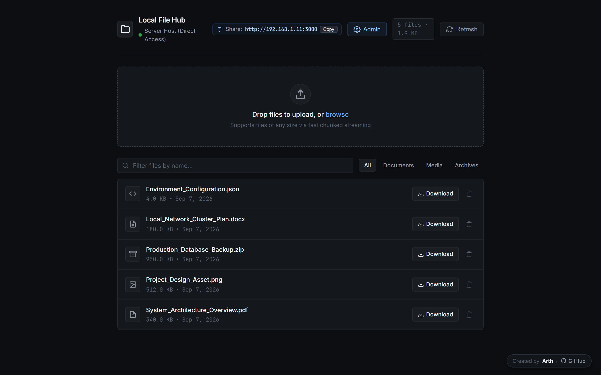
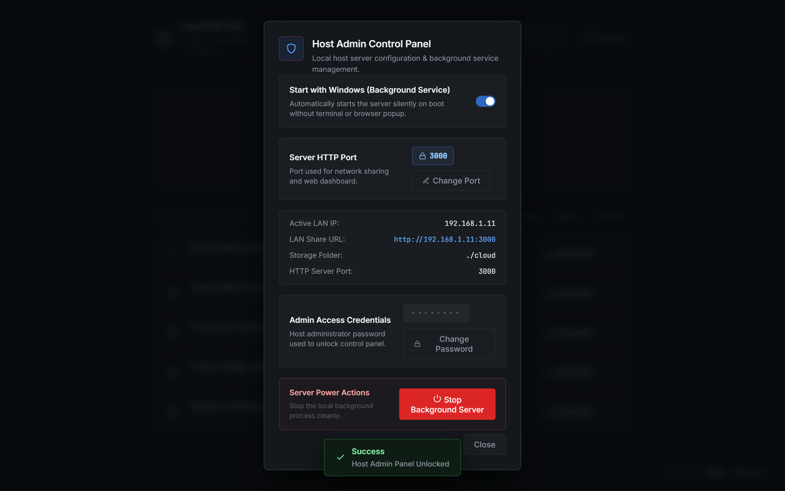
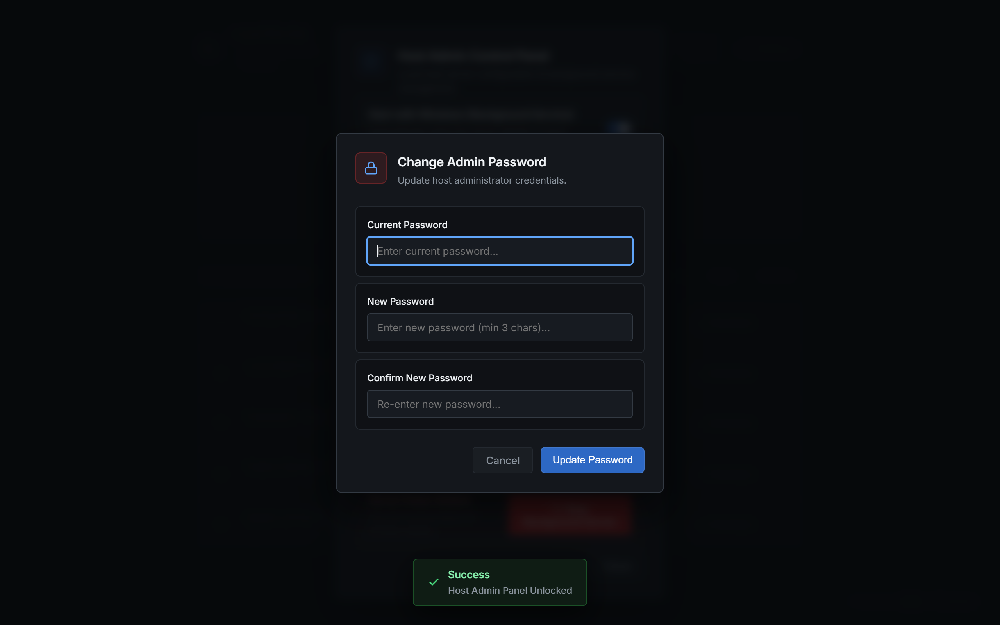
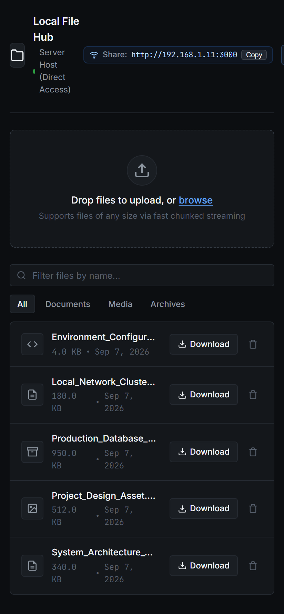

# KryinLocalFile 🚀

[](LICENSE)
[](https://github.com/ArthOfficial/KryinLocalFile)
[](https://nodejs.org/)
[-purple.svg)](#zero-console-gui-mode)

**KryinLocalFile** is an ultra-fast, peer-to-peer Local Area Network (LAN) file storage and streaming hub. It enables instantaneous sharing of multi-gigabyte files between PCs, laptops, iPhones, and Android devices across your local Wi-Fi network without relying on third-party cloud services or internet bandwidth.

Packaged as a standalone portable Windows executable (`KryinLocalFile.exe`) with **zero-console GUI execution** and a built-in **Windows Startup Background Service toggle**.

<br>

<div align="center">
  
  <p><em>Sleek, dark minimalist engineering UI for lightning-fast LAN file sharing and streaming.</em></p>
</div>

---

## 📸 Interface Showcase

<table width="100%">
  <tr>
    <td width="50%" align="center">
      <b>Host Admin Control Panel</b><br>
      <sub>Locked port editor, background service autostart, & power actions</sub><br><br>
      
    </td>
    <td width="50%" align="center">
      <b>Security Credentials Modal</b><br>
      <sub>Decoupled administrator password updating popup dialog</sub><br><br>
      
    </td>
  </tr>
  <tr>
    <td width="50%" align="center">
      <b>Cross-Platform Mobile Interface</b><br>
      <sub>Direct responsive touch UI for phones and tablets on Wi-Fi</sub><br><br>
      
    </td>
    <td width="50%" align="center">
      <b>Web Dashboard & LAN Sync</b><br>
      <sub>Dynamic Wi-Fi IP display, chunked upload stream, & category filtering</sub><br><br>
      
    </td>
  </tr>
</table>

---

## ✨ Features

- 🖥️ **Zero-Console Execution & Instant Launch**: Compiled with the Windows GUI PE subsystem. Double-clicking the `.exe` starts silently with zero scary command prompt popups or flickering terminal windows, automatically launching your default browser directly to the dashboard in milliseconds.
- 🛑 **One-Click Quick Stop Server**: Terminate the server cleanly anytime right from the top navigation bar with a dedicated host-authenticated Red Stop button, without needing Task Manager or terminal commands.
- ⚡ **Instant Multi-Launch Protection**: Intelligent single-instance lock detects running servers in under 5ms, focusing the browser immediately without duplicate processes, slow port scanning, or freezing.
- ⚙️ **Host Admin Control Panel**: Dedicated, password-protected control modal accessible only to the host computer. Customize the server HTTP port, update host administrator passwords, configure Windows autostart, inspect live network IPs, and shut down background processes.
- 🔄 **Windows Autostart (Background Service)**: Toggle "Start with Windows" directly from the Admin Panel. Runs silently in the background on startup (`--background`) ready for LAN requests.
- ⚡ **High-Speed Chunked Streaming**: Automatically slices large files into 50MB chunks with automatic retry logic and server-side reassembly, easily handling 10GB+ files without memory leaks.
- 📱 **Cross-Platform LAN Sharing**: Connect any phone, tablet, or computer on the same Wi-Fi using the displayed real Wi-Fi IP address.
- 🛡️ **Host Security & Remote RBAC**: Local server host enjoys full direct access. Remote clients across the network can view and download files, but require the Host Admin Password to delete files.
- 🎨 **Minimalist Engineering UI**: Dark responsive interface with real-time transfer progress, live upload speeds, search filtering, and file category pills (Documents, Media, Archives).

---

## 🚀 Quick Start

### Option 1: Run the Standalone Binary (No Node.js Required)

1. Download or locate `KryinLocalFile.exe`.
2. Double-click **`KryinLocalFile.exe`**.
3. Your default browser will automatically open to `http://localhost:20260`.
4. Other devices on your local Wi-Fi can connect to `http://<YOUR_LOCAL_IP>:20260`.

### Option 2: Run from Source

```bash
# Clone the repository
git clone https://github.com/ArthOfficial/KryinLocalFile.git
cd KryinLocalFile

# Install dependencies
npm install

# Start the server
npm start
```

---

## ⚙️ Configuration (`config.json`)

You can customize port, password, and browser behavior in `config.json`:

```json
{
  "port": 20260,
  "hostActionPassword": "2026",
  "adminPassword": "kryinadmin",
  "allowRemoteDeleteWithPassword": true,
  "autoOpenBrowser": true
}
```

| Field | Type | Description | Default |
|---|---|---|---|
| `port` | `number` | Port for the HTTP server to listen on (auto-falls back if port is occupied) | `20260` |
| `hostActionPassword` | `string` | Host admin password to unlock admin controls, shutdown server & autostart | `"2026"` (or `"kryinadmin"`) |
| `adminPassword` | `string` | Password required by remote LAN devices to delete files & manage settings | `"kryinadmin"` |
| `allowRemoteDeleteWithPassword` | `boolean` | Allow remote network users to delete files with password | `true` |
| `autoOpenBrowser` | `boolean` | Automatically open default browser on manual launch | `true` |

> **Smart Port Conflict Resolution**: If port `20260` is occupied by another application, KryinLocalFile will automatically try sequential fallback ports (`20261`, `20262`, etc.) and notify you in the UI. If another instance of KryinLocalFile is already running, it brings up your browser tab instantly without starting a duplicate server. If all ports fail, a native Windows alert box guides you to edit `config.json`.

---

## 🔄 Windows Autostart & Background Mode

KryinLocalFile features deep integration with the Windows user registry:

- **Enable via Web UI**: Toggle **"Start with Windows"** in the top navigation bar.
- **Silent Boot**: On system restart, Windows launches `KryinLocalFile.exe --background`.
  - No command prompt is displayed.
  - No browser tab pops up.
  - The server runs silently in the background, serving files to your phone and local network.
- **Registry Key**: Managed in `HKCU\Software\Microsoft\Windows\CurrentVersion\Run\KryinLocalFile` (requires no administrator elevation).

---

## 🛠️ Building Standalone Executable

To compile your own zero-console `.exe` from source:

```bash
# Build standalone KryinLocalFile.exe
npm run build:exe
```

### Build Pipeline Overview:
1. **`build-assets.js`**: Compiles frontend assets (`index.html`, `style.css`, `app.js`) into base64 embedded golden master fallbacks.
2. **`esbuild`**: Bundles backend dependencies into `dist/bundle.js`.
3. **`node SEA`**: Generates Single Executable Application blob (`dist/sea-prep.blob`).
4. **`postject`**: Injects SEA blob into Node container.
5. **`PE Subsystem Patch`**: Automatically patches PE header offset to Subsystem `2` (Windows GUI), eliminating the terminal window.

---

## 📡 API Reference

### System & Status
- `GET /api/status` — Returns host status, local IP, port, and security settings.
- `GET /api/autostart` — Checks Windows registry autostart status.
- `POST /api/autostart` — `{ "enabled": boolean }` (Host only) Updates Windows autostart.
- `POST /api/system/shutdown` — (Host only) Gracefully terminates the background server.

### File Operations
- `GET /api/files` — Returns list of files, sizes, timestamps, and types.
- `GET /api/download/:filename` — Downloads requested file from shared storage.
- `DELETE /api/files/:filename` — Deletes file (direct for host; header `x-admin-password` required for LAN clients).

### Upload Endpoints
- `PUT /api/upload/chunk` — Streams individual 50MB file binary chunks with headers `x-upload-id`, `x-chunk-index`, `x-total-chunks`, `x-filename`.
- `POST /api/upload/complete` — Reassembles all uploaded chunks into the final destination file.

---

## 🔒 Security Architecture

- **No Blind IP Spoofing**: `isHostRequest` checks socket-level IP bindings directly, preventing attackers from bypassing delete permissions using spoofed `X-Forwarded-For` headers.
- **Sanitized Paths**: All incoming filenames are sanitized using `path.basename` to prevent directory traversal attacks.
- **LAN Protection**: Remote clients cannot delete files or access administrative system commands without authentication.

---

## 📄 License

This project is licensed under the [MIT License](LICENSE) — see the [LICENSE](LICENSE) file for details.
